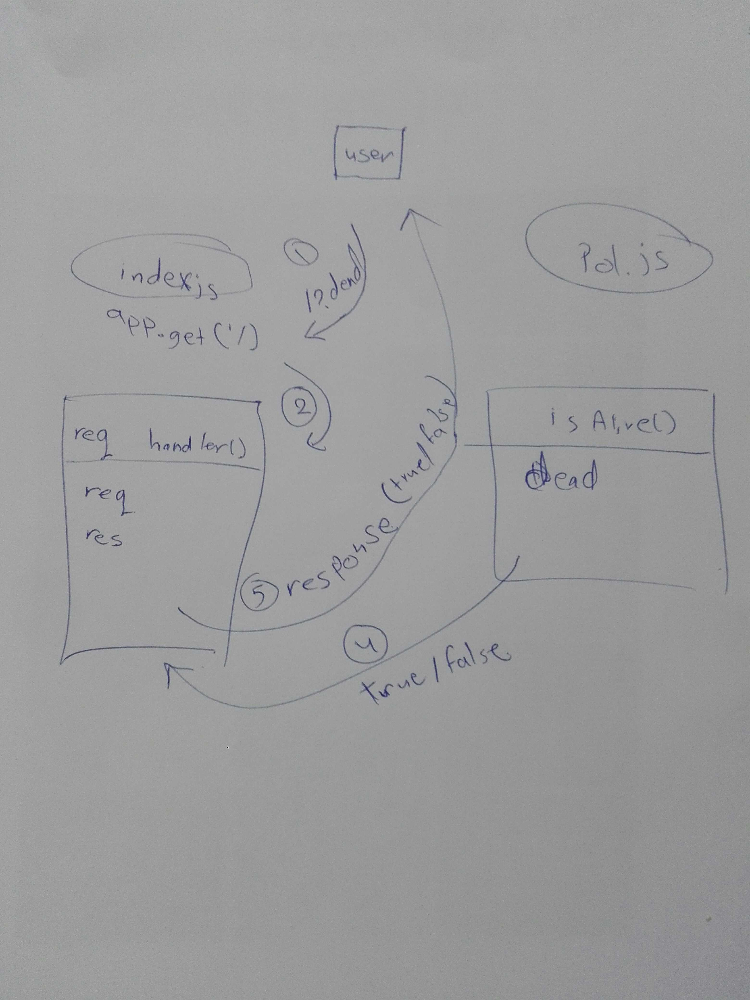

# LAB - Class 00

## Project: Proof of life server

### Author: Batool Al-Ali

### Links and Resources

- [submission PR](https://github.com/batool-alali-401-advanced-javascript/lab-00/pull/1)
- [travis](https://travis-ci.com/github/batool-alali-401-advanced-javascript/lab-00)
- [front-end application](https://lab00-batool.herokuapp.com/)

#### Documentation
- [jsdoc](https://lab00-batool.herokuapp.com/docs/)

### Modules

#### `pos.js`
##### Export Values and Methods

##### `isAlive(dead) -> boolean`

Return true/false to indicate how server works.

### Setup

#### `.env` requirements 
- `PORT` - Port Number

#### How to initialize/run your application

- `npm start`

- Endpoint : `/`
    - Retarns a boolean

- Endpoint : `/docs`
    - Retarns a JsDoc Documentation pages

#### Tests
- Unit Tests : `npm test`
- Unit Tests : `npm run lint`

#### UML
